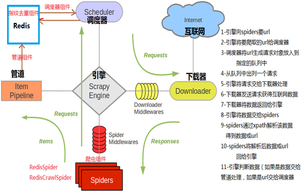
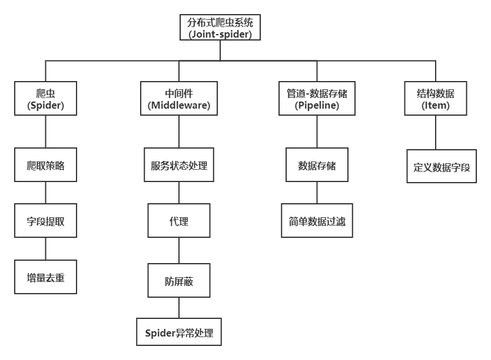
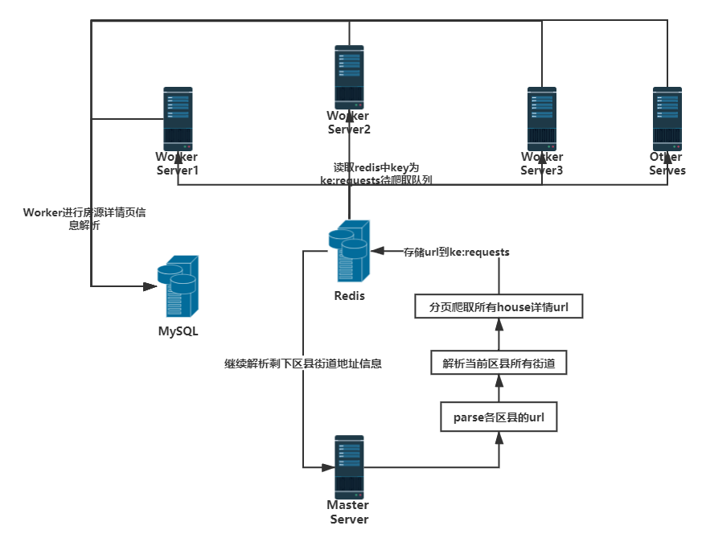
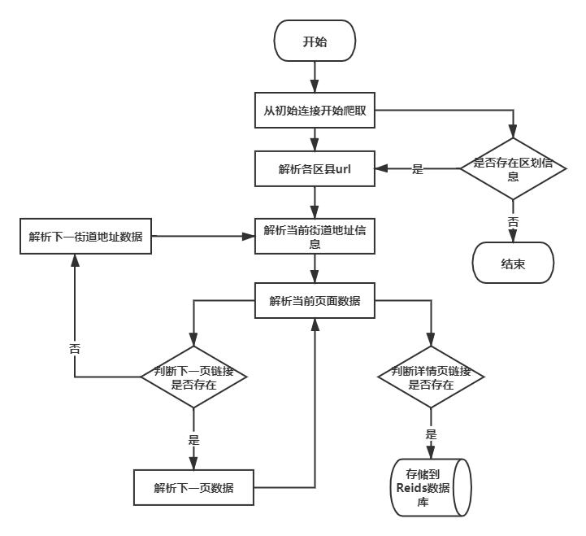
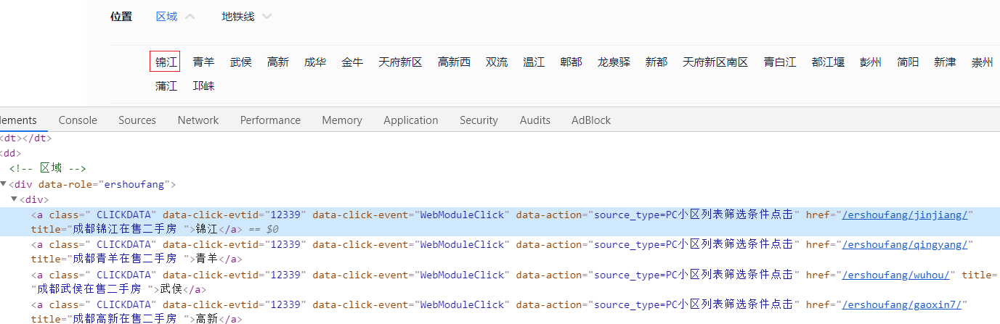
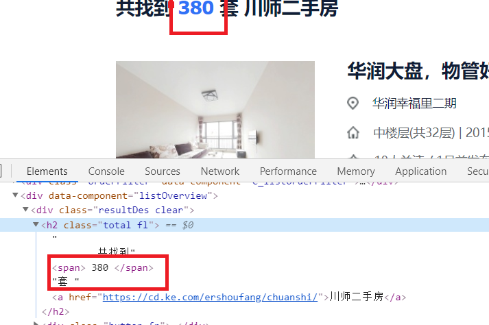
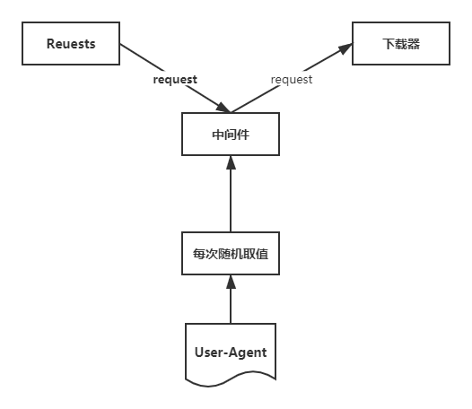
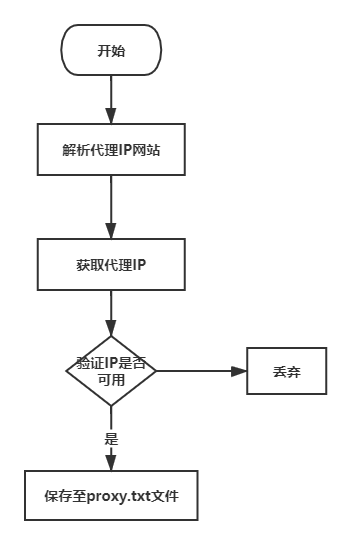
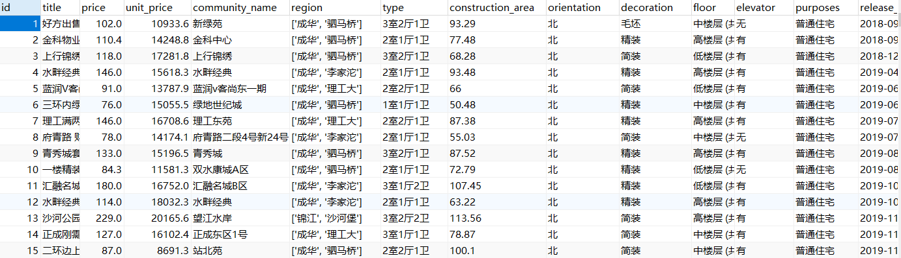
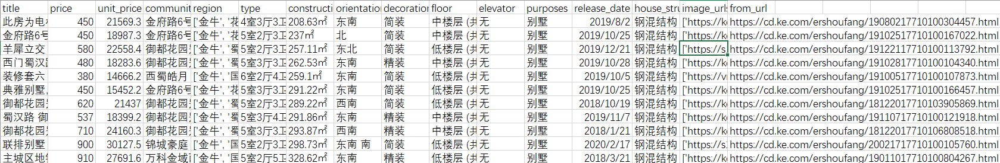

# Joint-spider


<p align="center"></p>

<p align="center">
<a href="https://pypi.python.org/pypi/Scrapy"></a>
<a href="https://pypi.python.org/pypi/Scrapy"></a>
<a href="https://codecov.io/github/scrapy/scrapy?branch=master"></a>
</p>


Scrapy-Redis 架构：




> 成都贝壳，安居客房源信息爬虫

> 基于 `python` 分布式房源数据爬取系统,为房价数据挖掘及可视化提供数据支持。采用 `Scrapy` 框架来开发，使用 `Xpath` 技术对下载的网页进行提取解析，运用 `Redis` 数据库做分布式，使用Mysql数据库做数据存储，同时保存与`CSV`文件中.

## 应用技术

- Python 网络爬虫技术
  - Requests
  - Scrapy
  - xpath
- Python 文件操作
  - CSV 
  - TXT
- Python 数据库操作技术
  - Mysql
  - Redis

### 项目相关依赖库

- Scrapy==1.6.0
- scrapy-redis==0.6.8
- scrapy-redis-bloomfilter==0.7.0
- PyMySQL==0.9.3
- redis==3.0.1
- requests==2.21.0
- SQLAlchemy==1.3.2
- Twisted==18.9.0


### 环境配置及项目启动

> 整个项目就是基于scrapy-redis的一个分布式项目

```shell
# 环境配置需要 python3.7 redis mysql
# 
# 项目启动
# 1. 运行代理 IPProxy.py
 	 python IPProxy.py # 注意: 既使挑选处理优质代理IP， 但还是存在IP无法工作的问题，
 	 				   # 公开IP极其不稳定，建议花钱
# 2. 部署Master端,进入项目目录\unionSpider\bk_spider\bk\bk下
	 python start.py
# 3. redis数据库插入起始url
	 lpush start_urls https://cd.ke.com/ershoufang/
# 4. 部署worker端,进入项目目录\unionSpider\bk_spider\bk_slave\bk_slave下
	 python start.py
```

### 项目需要改进

1. 部署至服务器
2. 重构优化代码（代码实在写得太烂了）
3. 优化去重，断点续爬，增量爬取
4. 实现爬虫服务动态更新
5. 增加爬虫运行监控

### 项目注意事项

1.  Redis配置项 进入\unionSpider\bk_spider\bk\bk\utils中修改相关Redis服务配置
2. Mysql配置项 进入 \unionSpider\bk_spider\bk\bk\中直接修改pipline文件中的mysql服务配置


## 项目介绍:


### 一 .  系统功能架构



### 二. 系统分布架构

分布式采用主从结构设置一个Master服务器和多个Worker服务器，Master端管理Redis数据库和分发下载任务，Woker部署Scrapy爬虫提取网页和解析提取数据，最后将解析的数据存储在Mysql数据库中或保存为本地CSV文件。分布式爬虫架构如图所示。



​	应用`Redis`数据库实现分布式抓取，基本思想是`Scrapy`爬虫获取的到的房源详情页的urls都放到`Redis Queue`中，所有爬虫也都从指定的`Redis Queue中`获取urls，`Scrapy-Redis`组件中默认使用`SpiderPriorityQueue`来确定url的先后次序，这是由sorted set实现的一种非FIFO、LIFO方式。因此，待爬队列的共享是爬虫可以部署在其他服务器上完成同一个爬取任务的一个关键点。此外，为了解决Scrapy单机局限的问题，`Scrapy`结合`Scrapy-Redis`进行开发，`Scrapy-Redis`总体思路就是这个工程通过重写`Scrapy`框架中的`scheduler`和`spider`类，实现了调度、`spider`启动和`redis`的交互。实现新的`dupefilter`和`queue`类，达到了判重和调度容器和`redis`的交互，因为每个主机上的爬虫进程都访问同一个redis数据库，所以调度和判重都统一进行统一管理，达到了分布式爬虫的目的。


### 三. 系统实现

**1）爬取策略的设计**

由`scrapy`的结构分析可知，网络爬虫从初始地址开始，根据spider中定义的目标地址获的正则表达式或者`Xpath`获得更多的网页链接，并加入到待下载队列当中，进行去重和排序之后，等待调度器的调度。

在Master端中，链接可以分为四类，分别是

1. 全部房源信息入口页链接,既首页链接`https://cd.ke.com/ershoufang/`
2. 行政区划入口链接，既`https://cd.ke.com/ershoufang/jinjiang/`
3. 房源列表下一页链接,既`https://cd.ke.com/ershoufang/jinjiang/pg2/`
4. 房源详情页链接,既`https://cd.ke.com/ershoufang/106104159569.html?fb_expo_id=306121790391377920`指向的就是实际的房源信息页面。

网络需从首页链接进入，提取到所有区划页链接，解析出所有房源详情页链接,加入到待下载队列准备进一步爬取。流程如下:




在Worker端中，直接进行目标数据解析,主要抓取数据有:

```python
# 房源名称
# 房源总价
# 房源单价
# 小区名字
# 地区,位置
# 户型
# 建筑面积
# 房屋朝向
# 装修情况
# 所在楼层
# 电梯
# 房屋用途 房屋类型
# 挂牌时间 建造年代
# 房源图片
# 房源来源
# 建筑结构
```

爬虫从detail_url进入页面,通过`Xpath`和其他网页结构解析工具抓取相应数据,并保存到MySQL和CSV文件中。


因为采取的分布式主从模式，Master端爬虫主要爬取下载到内容详情页链接，通过redis分享下载任务给其他Woker端的爬虫。Woker端主要是负责对详情页链接的进一步解析提取存储到数据库中。

**2）爬虫的具体实现**

1. 数据抓取程序

Master端：



```python
# 解析各区县url
index = response.xpath("//*[@id='beike']/div[1]/div[1]/div/ul/li[2]/a/@href")
				.extract()[0].replace('/ershoufang/', '')
# 得到idnex: https://cd.ke.com
# 得到区划名称
hrefs = response.xpath("//*[@class=' CLICKDATA']/@href").extract()
# 例/ershoufang/jinjiang/
for href in hrefs:
    # 拼接
    url = '%s%s' % (index, href)
    yield scrapy.Request(url, callback=self.parse_site) # parse_site 为解析街道url方法
```

解析成功区划url后，进入到对应区划页面，例如：https://cd.ke.com/ershoufang/jinjiang/

然后进行街道等地址url解析:


```python
# 解析所有街道url
# 例/ershoufang/chuanshi/
streets = response.xpath("//*[@class='position']/dl[2]/dd/div[1]/div[2]/a/@href").getall()
# 得到idnex: https://cd.ke.com
index = response.xpath(
                "//*[@id='beike']/div[1]/div[1]/div/ul/li[2]/a/@href")
				.extract()[0].replace('/ershoufang/', '')
for url in streets:
    url = '%s%s' % (index, url) # 拼接
    # url: https://cd.ke.com/ershoufang/chuanshi/
    yield scrapy.Request(url, callback=self.parse_url,meta={'url':url}) # parse_url 为解析page的方法
```

解析成功街道url后，进入到页面，例如：https://cd.ke.com/ershoufang/chuanshi/

然后进行分页爬取：



```python
# 分页爬取
num = response.xpath('//*[@id="beike"]/div[1]/div[4]/div[1]/div[2]/div[1]/h2/span/text()').get()
# 房源数
num = int(num)
# 计算总页数
page_num = 100 if math.ceil(num / 30) > 100 else math.ceil(num / 30)
for i in range(page_num):
    url = response.meta.get('url')
    # 拼接url
    url = url + 'pg' + str(i + 1)
    yield scrapy.Request(url, callback=self.parse_item,dont_filter=False) # parse_item为解析房源先详情页url的方法
```

Worker端最后的工作：解析house_detail urls


```python
for info in response.xpath("//*[@class='info clear']"):
    # 获取当前房源列表中所有的房源
    item_url = info.xpath("./div[1]/a/@href").extract()[0]
    if item_url:
        # 插入redis数据库
        inserintota(item_url, 2)
```

至此，Master端的页面解析完成 。

Worker端：

Worker端比较简单，只有定向的数据抓取，只需简单进行xpath解析

例： 对于房源小区名抓取：` item['community_name'] = response.css(
            '#beike > div.sellDetailPage > div:nth-child(6) > div > div.content > div.aroundInfo > div.communityName > a.info.no_resblock_a::text').extract_first()`


**3）去重与增量爬取**

​	“去重”是日常工作中会经常用到的一项技能，在爬虫领域更是常用，并且规模一般都比较大。去重需要考虑两个点：去重的数据量、去重速度。为了保持较快的去重速度，一般选择在内存中进行去重。

- 数据量不大时，可以直接放在内存里面进行去重，例如python可以使用set()进行去重。
- 当去重数据需要持久化时可以使用redis的set数据结构。
- 当数据量再大一点时，可以用不同的加密算法先将长字符串压缩成 16/32/40 个字符，再使用上面两种方法去重；
- 当数据量达到亿（甚至十亿、百亿）数量级时，内存有限，必须用“位”来去重，才能够满足需求。Bloomfilter就是将去重对象映射到几个内存“位”，通过几个位的 0/1值来判断一个对象是否已经存在。
- 然而Bloomfilter运行在一台机器的内存上，不方便持久化（机器down掉就什么都没啦），也不方便分布式爬虫的统一去重。如果可以在Redis上申请内存进行Bloomfilter，以上两个问题就都能解决了。

​	我们可以自己写简单的过滤器，当然`scrapy-redis`页自带了过滤器，可以直接进行配置使用，不过由于这里我们数据量超过了10万，所以这里我们使用布隆过滤器，既`Bloom-Filter `。

> Bloom-Filter一般用于在大数据量的集合中判定某元素是否存在。

一般Bloom-Filter可以与一些key-value的数据库一起使用，比如我们这里的Redis，来加快查询。

一般key-value存储系统的values存在硬盘，查询就是件费时的事。将Storage的数据都插入Filter，在Filter中查询都不存在时，那就不需要去Storage查询了。当False Position出现时，只是会导致一次多余的Storage查询。

由于Bloom-Filter所用的空间非常小，所有BF可以常驻内存。这样子的话，对于大部分不存在的元素，我们只需要访问内存中的Bloom-Filter就可以判断出来了，只有一小部分，我们需要访问在硬盘上的key-value数据库。从而大大地提高了效率。


scrapy_redis对接`Bloom-Filter `：

```shell
pip3 install scrapy-redis-bloomfilter
```

使用的方法和Scrapy-Redis基本相似，在这里说明几个关键配置。

```python
# 去重类，要使用Bloom Filter请替换DUPEFILTER_CLASS
DUPEFILTER_CLASS = "scrapy_redis_bloomfilter.dupefilter.RFPDupeFilter"
# 散列函数的个数，默认为6，可以自行修改
BLOOMFILTER_HASH_NUMBER = 6
# Bloom Filter的bit参数，默认30，占用128MB空间，去重量级1亿
BLOOMFILTER_BIT = 30
```


**4）爬虫中间件**

1. **爬虫防屏蔽组件的实现**

访问一个网站的网页的时候，会给网站带了一定的负载，而爬虫程序则是模拟了我们正常访问网页的过程，但是，大规模的爬虫会给网站增加大量的负载，影响正常用户的访问。为保证网页能够别大多数正常用户的访问，大多数网站都有相应的防爬虫策略。一旦访问行为被认定为爬虫，网站将会采取一定的措施，限制你的访问，比如提示你，访问过于频繁让你输入验证码，更严重者，会封掉你的ip，禁止你访问该网站。

此项目采用以下方法来防止爬虫被屏蔽:

- 模拟不同的浏览器行为

- 以一定的频率更换代理服务器和网关

- 降低爬虫爬取网页的频率，减少并发爬取的进程，限制每个ip并发爬取的次数，牺牲一定的效率来换取系统的稳定性。

- 禁用cookie，网站会在用户访问时在cookie中插入一些信息来判断是否是机器人，我们屏蔽调cookie，也有利于我们的身份不同意暴露。


a) 与模拟不同的浏览器行为

​	原理图：



在mildeware.py文件中增加一个下载中间件UserAgentDownLoadMildeware

```python
class UserAgentDownLoadMildeware(object):

    def __init__(self, user_agent_list):
        self.user_agent = user_agent_list

    @classmethod
    def from_crawler(cls, crawler, *args, **kwargs):
        middleware = cls(crawler.settings.get('USER_AGENT_LIST'))
        return middleware

    def process_request(self, request, spider):
        print('this is request user_agent' + random.choice(self.user_agent))
        request.headers['user-agent'] = random.choice(self.user_agent)
```

在settings.py 文件中定义一个User-Agent列表

```python
USER_AGENT_LIST = [
    "Mozilla/5.0 (Windows NT 6.1; WOW64) AppleWebKit/537.1 (KHTML, like Gecko) Chrome/22.0.1207.1 Safari/537.1",
    "其他user-agent"
]
```

并添加中间件到配置中:

```python
DOWNLOADER_MIDDLEWARES = {
   'bk.middlewares.UserAgentDownLoadMildeware': 543,
}
```

b) 以一定的频率更换代理服务器和网关

代理ip池的设计与开发流程如下:



IP池抓取代码在`\unionSpider\bk_spider\bk_slave\bk_slave\utils\proxies.py`中

与模拟不同的浏览器行为同理，添加ProxyMiddleWare到mildeware.py中

```python
class ProxyMiddleWare(object):
    """docstring for ProxyMiddleWare"""

    def process_request(self, request, spider):
        '''对request对象加上proxy'''
        proxy = self.get_random_proxy()
        print("this is request ip:" + proxy)
        request.meta['proxy'] = proxy

    def process_response(self, request, response, spider):
        '''对返回的response处理'''
        # 如果返回的response状态不是200，重新生成当前request对象
        if response.status != 200:
            proxy = self.get_random_proxy()
            print("this is response ip:" + proxy)
            # 对当前reque加上代理
            request.meta['proxy'] = proxy
            return request
        return response

    def get_random_proxy(self):
        '''随机从文件中读取proxy'''
        while 1:
            # with open('./utils/proxies.txt', 'r') as f:
            with open('./utils/proxy.txt', 'r') as f:
                proxies = f.readlines()
            if proxies:
                break
            else:
                time.sleep(1)
        proxy = random.choice(proxies).strip()
        return proxy
```

然后在settings中添加中间件‘

```python
DOWNLOADER_MIDDLEWARES = {
   'bk.middlewares.UserAgentDownLoadMildeware': 543,
   'bk.middlewares.ProxyMiddleWare': 545,
}
```

上面的get_random_proxy()方法是进行随机IP选择，用以替换我们本机IP

c) 限制请求频数和禁用cookie

直接在settings.py文件中进行配置即可：

```python
# 下载延时
DOWNLOAD_DELAY = 3
# 禁用cookie
COOKIES_ENABLED = False
```

**5）管道Pipeline**

数据存储模块主要负责将Worker端爬取解析的页面进行存储。使用Mysql对数据进行存储。

`Scrapy`支持数据存储的格式有`json`，`csv`和`xml`等文本格式，用户可以在运行爬虫时设置，例如:`scrapy crawl spider -o items.json -t json`,也可以在`Scrapy`工程文件额`ItemPipline`文件中定义，同时，Scrapy也支持数据库存储，如`MySQL`，`Monogdb`，`Redis`等，当数据量大到一定程度时，可以做Mongodb或者Reids的集群来解决问题 。

1. 抓取字段设计

| 字段名称          | 字段含义     |
| :---------------- | :----------- |
| title             | 房源名称     |
| price             | 房源总价     |
| unit_price        | 房源单价     |
| community_name    | 所在小区名字 |
| region            | 所在行政区划 |
| type              | 户型         |
| construction_area | 建筑面积     |
| orientation       | 房屋朝向     |
| decoration        | 装修情况     |
| floor             | 楼层         |
| elevator          | 电梯情况     |
| purposes          | 房屋用途     |
| release_date      | 挂牌时间     |
| image_urls        | 房源图片     |
| from_url          | 房源来源     |
| house_structure   | 建筑结构     |

2. 保存数据

在settings.py中添加pipeline

```python
ITEM_PIPELINES = {
   #'bk.pipelines.CSVPipeline': 300,
   'bk.pipelines.MySQLPipeline': 320,
}
```


- 存入MySQL

  ```python
  class MySQLPipeline(object):
      def __init__(self):
          # 连接数据库
          self.connect = pymysql.connect(
              host='127.0.0.1',  # 数据库地址
              port=3306,  # 数据库端口
              db='house',  # 数据库名
              user='root',  # 数据库用户名
              passwd='root',  # 数据库密码
              charset='utf8',  # 编码方式
              use_unicode=True)
          # 通过cursor执行增删查改
          self.cursor = self.connect.cursor();
  
      def process_item(self, item, spider):
          self.cursor.execute(
              """insert into chuanke(title,price,unit_price,community_name,region,type,construction_area,orientation,decoration,floor,elevator,purposes,release_date,house_structure,image_urls,from_url)
              value (%s, %s, %s, %s, %s, %s, %s, %s, %s, %s, %s, %s, %s, %s, %s, %s)""", 
              (item['title'],  # item里面定义的字段和表字段对应
               item['price'],
               item['unit_price'],
               item['community_name'],
               item['region'],
               item['type'],
               item['XXXXXXXXXXXXXX']
              ))
  
          # 提交sql语句
          self.connect.commit()
          return item  # 必须实现返回
  ```

- 保存到CSV

  ```python
  class CSVPipeline(object):
      index = 0
      file = None
  
      def open_spider(self, spider):
          # encoding='utf-8
          self.file = open("XXX", "a",newline='')
  
      def process_item(self, item, spider):
          if self.index == 0:
              column_name = "title,price,unit_price,community_name,region,type,construction_area,orientation,decoration,floor,elevator,purposes,release_date,house_structure,image_urls,from_url\n"
              self.file.write(column_name)
              self.index = 1
          self.writer = csv.writer(self.file)
          self.writer.writerow((item['title'], item['price'], item['unit_price'], item['community_name'],
                                          item['region'], item['type'], item['construction_area'], item['orientation'],
                                          item['decoration'],item['floor'],item['elevator'],item['purposes'],item['release_date'],
                                          item['house_structure'],item['image_urls'],item['from_url']))
          return item
  
      def close_spider(self, spider):
          self.file.close()
  ```

  

### 四. 结果展示

Mysql数据库中：



CSV文件中：

